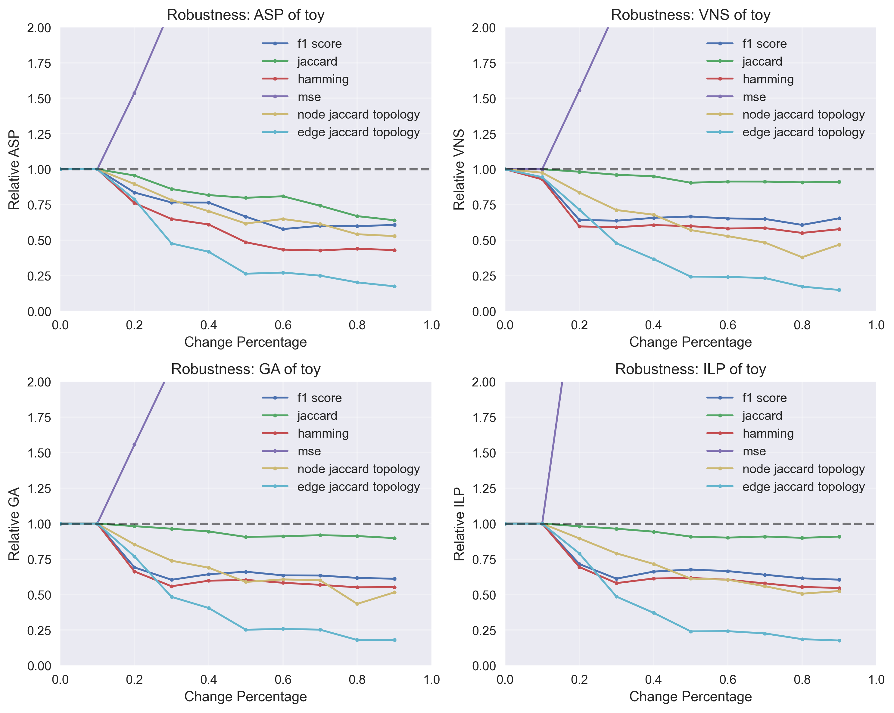
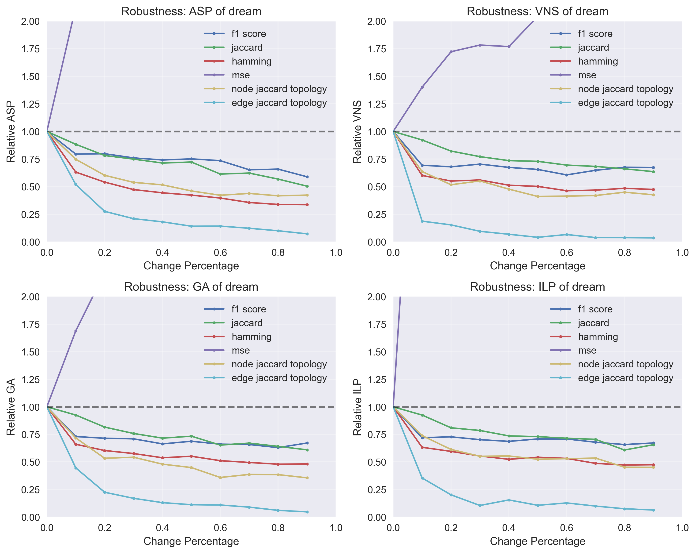
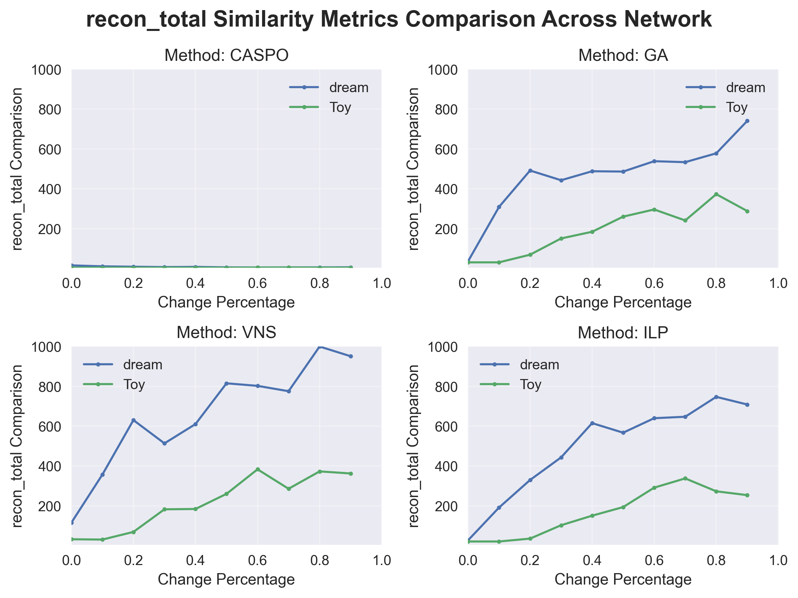

# Introduction

All expected functions have been successfully implemented and tested(around 1h for 10 times), making the codebase ready for further testing and practical usage. However, a significant challenge emerged in the comparison methodology, particularly evident in robustness analysis where perturbed networks paradoxically showed higher evaluation scores than the original networks.

This counterintuitive result stems from fundamental issues in attractor comparison when dealing with networks of varying sizes and differing attractor counts. When PKN are perturbed, they often generate substantially more attractors than the original network, creating an unfair advantage in similarity calculations through what amounts to a "statistical lottery" effect.

To address this, I implemented a more robust comparison method that can handle variable network sizes and attractor counts. I used the percentage of basin as weight for similarity calculation. And I projected attractors onto all nodes rather than just the common ones, which used mask to avoid bring new bias. 

But this method is not perfect, as it still has some bias. `penalty = 2.0 / (1.0 + np.exp(0.5 * (ratio - 2)))`  is used to penalize the similarity when the ratio of attractors is larger than 2.0, but it brings new bias between `caspo` and other methods.

## Results

### 1. The number of attractors
An intriguing finding emerges from the attractor count analysis. While ASP-based methods demonstrate numerous false positives in other metrics, they excel at maintaining biologically realistic attractor counts. This suggests that different reconstruction methods may be optimizing for fundamentally different aspects of network behavior, with some prioritizing topological accuracy and others focusing on dynamical properties.

### 2. Performance
Throughout Jaccard similarity and Hamming similarity(1-hamming distance), it is difficult to distinguish the performance.

### 3. Robustness
The robustness analysis reveals that `VNS` (Variable Neighborhood Search) and `GA` (Genetic Algorithm) demonstrate superior stability compared to `CASPO` and `ILP` (Integer Linear Programming) methods. Particularly noteworthy is their performance under small perturbations, where these metaheuristic approaches maintain both attractor similarity and topological consistency with the original network. This suggests that optimization-based methods may discover more fundamentally stable network structures.

### 4. Running time

The runtime comparison demonstrates the expected trade-off between solution quality and computational efficiency. `VNS` and `GA` require substantially more computational resources, reflecting their exhaustive search strategies. In contrast, `CASPO` and `ILP` methods achieve faster execution times through more targeted optimization approaches. Interestingly, runtime performance remains relatively consistent across different network configurations for each method.

### 5. Comparison with different network sizes
Composition score comparison:

From those graphs , we can notice there is one wired phenomenon: the values at zero change. Two guess: 
Since `cellnopt` will preprocessing during saving and before training. After preprocessing, the network size will be smaller than the original one. So the results is different from the original one. But this is likely not the reason, because `caspo` does not do preprocessing, but the results is still different.
The second guess is that the purpose of those methods which are to find the cloeest network based on the experimental data. So the results are not the same as the original one, even if the network size is zero.

hamming similarity comparison:

jaccard similarity comparison:

jaccard topology comparison:

total time comparison:

number of reconstructed attractors comparison:

## First Month Internship Reflection

This initial period has been fundamentally a learning and adaptation phase, requiring rapid acquisition of new knowledge across multiple domains while navigating unexpected technical challenges.

- **Knowledge Acquisition**: The internship demanded mastery of complex methodological backgrounds spanning computational biology, network theory, and optimization algorithms. The lack of extensive biological background initially created comprehension gaps regarding the biological significance of computational results, though this understanding has developed progressively through practical application.
- **Technical Integration**: Integrating tools developed in different programming languages and frameworks presented substantial challenges. Issues ranged from data format incompatibilities and parallelization complexities to debugging legacy code implementations. These experiences have provided valuable lessons in software integration and cross-platform development.
- **Project Management and Adaptation**:  Initial difficulties in time estimation for unfamiliar tasks created some project stress. However, this experience has improved my ability to assess task complexity and manage expectations in research environments.

### Completed Deliverables
The first month has produced several concrete outcomes. I have thoroughly reviewed the relevant literature, developed comprehensive understanding of the methodological approaches, and produced detailed technical documentation. The implementation includes all core functionality for network perturbation, topological analysis, comparative evaluation, parallel processing, and results visualization. Additionally, I have systematically organized the codebase with comprehensive documentation to facilitate future development and usage.

### Future Development Priorities
Several important tasks remain for complete project maturation. Cross-validation implementation will provide more robust performance assessment across different network types and sizes. Additional testing phases will ensure code reliability and identify edge cases that require special handling.

- Check `Caspo` running time, it is too short.
    - `Caspo` support parallel execution, modified the code by using its time statistics. Still fast.
- Check parallelization issues, sometimes some tasks does not return result.
    - `CPLEX` does not support parallel execution. Modified the code for running `ILP` tasks sequentially.
    - The process of generating data have conflicts. Add lock mechanism to ensure data consistency.

## Discussion and Questions

1. **Internship Timeline**: Could you confirm the second internship period timing of August 18 through September 12 (four weeks)? First internship is five weeks.
2. **Performance Evaluation**: I would greatly appreciate feedback on my performance during this internship period. Are there specific areas where I could improve my approach or focus my development efforts?
3. **Research Direction**: Given the comparative results we've obtained, what aspects of this analysis would be most valuable to explore further in the continuing work?